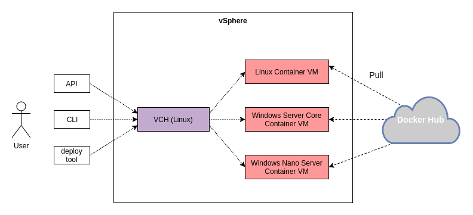
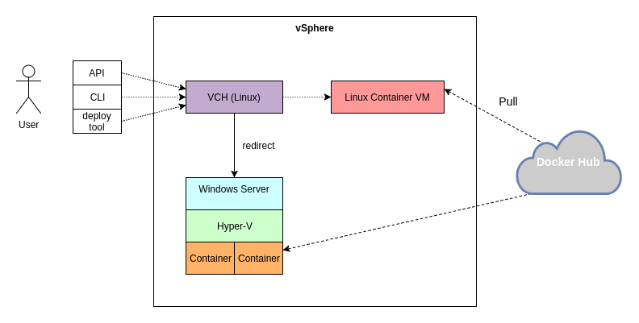
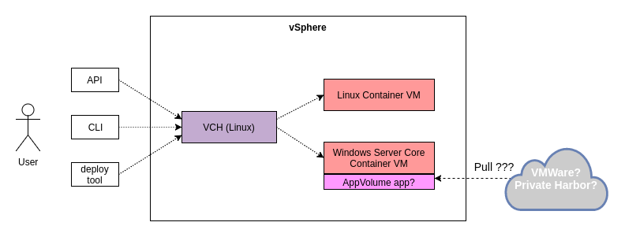

# Windows Containers

## Introduction

For 1.3, we will add some support for Windows containers, with more support coming in future releases.  Before engineering implements Windows containers, we need to define what this support implies and review the pros/cons of various design options.

## Definition of Windows Containers

Before discussing what we implement, we will first define Windows Containers.  Containers, in general, are software deployment units that run in an isolated environment with a base OS or OS libraries (usually Linux).  Windows containers are simply Windows applications running as deployable containment units in an isolated environment that supports Windows libraries and kernel support.  In many ways, windows containers is a generic term.  It may be a docker container that runs within a isolation environment within a Windows kernel.  It may be a windows VM, since the VM provides very strong isolation.  Note, we have not yet used the term Microsoft Windows Containers (more on that later).  The following are the characteristics of a Windows Container:

1. Self contained deployment unit
1. A registry to store these windows containers and retrieve them to deploy and execute
1. An isolation environment where processes in one container does not affect processes in another container

Microsoft has introduced Micrsoft Windows Containers.  They worked with Docker to make these containers compatible with the Docker CLI, Docker APIs, and other Docker compatible tools.  Their containers have slightly different build processes, directives, and runs within either a user space isolation environment or a Hyper-V container.

Microsoft's approach is not the only way to define a Windows container.  As long a "windows container" fullfills the above 3 criteria, it should still provide all the same benefits.  For VIC, we have the option to support two types of Windows containers.

1. Microsoft Windows Containers (Hyper-V containers only)
1. VMWare defined legacy Windows Containers that supports older applications compatible with older versions of Windows (e.g. Windows XP)

Choice #2 above would allow VIC to support older applications that runs on OS environment that are no longer supported by Microsoft.  The |disadvantage of the legacy Windowd containers support is that we would need to build the mechanism for registering those containers as well as the mechanism for packaging those containers.  Supporting one in VIC 1.3 does not preclude VIC from supporting the other type in future releases.

## What does **Support** Mean?

When we released VIC, we marketed docker API compatibility.  That opened VIC up to supporting a very large API surface.  In hindsight, this may not have been the best marketing move.  The VIC engineering team does not have the resources to catch up to full Docker API compatibility, which is constantly evolving with the help of a vast army of open source developers assisting Docker.

Internally, we stated VIC was focused on production deployment, but externally, we had difficulty explaining what this meant after we promised API compatibility.  What can we do differently for Windows Containers?  What are our options?

### Advertise API compatibility

This is a continuation of VIC’s current strategy.

| Pros | Cons |
| --- | --- |
| 1. Easy for Users to understand | 1. Impossible to be full API complete |
| 2. Operations for Admin and Developers share the same API surface | 2. Messaging becomes API compatibility instead of production workload |
| | 3. Engineering will have it’s hands full on validating another OS.  Currently, we can only guarantee functionality on Linux, specifically Photon OS. |

### Implement targeted deployment workflow and UI for production deployment

Target VIC 1.3 to production deployment of Windows Containers and skip the promise of Docker API compatibility for future versions of VIC.  The validation effort of getting VIC compatible with another OS, especially one that differ so much from the base container OS (Linux) that VIC currently supports, will take the majority of the development time for VIC 1.3.

The only way we can deliver Windows Containers support in VIC 1.3 that we can be proud of is to focus the deliverable to a very targeted set of production deployment workflows.  Based on these workflows, we can target implementing the necessary APIs and tools to satisfy those workflows.

#### Workflows

1. Assemble a multi-tier application made of Windows Containers
1. Deploy a multi-tier application
1. Stop a multi-tier application
1. Remove a multi-tier application
1. Monitor a multi-tier application

#### Tools and APIs

For VIC 1.3, it will be extremely difficult to validate and resolve issues with a new OS and ensure all of VIC's current Docker API support works with Windows Container.  We need to stay extremely focus on the workflows above.  Since we are focused on production deployment workflows, it will be wise not to promise Docker API and Docker CLI compatibility for Windows containers.  This should help us avoid promising support for such features as attach, exec, cp, rename, etc. in VIC 1.3.  Instead of a minimal viable product that has some features working and others not working and struggling to explain it to customers, we can build a targeted set of tools/apis that addresses production workflows.

1. Focus development on the set of Docker APIs necessary for the above workflows and validate Docker Compose support for Windows Containers.
1. Develop our own CLI for deploying Windows containers, with only the ability to pull, start, stop, remove.  The CLI can either talk to the Persona, via Docker APIs or directly to the Portlayer APIs.  The downside with this approach is that we leave the the multi-tier deployment to users.  They will have to script the deployment themselves.
1. Develop an HTML 5 deployment tool that uses either the docker APIs or portlayer APIs to deploy Windows containers application.

## Potential Strawman Architectures

Here are a few possible approaches to supporting Windows containers in VIC 1.3.  There may be more options.  The path we take will depend on which type of Windows containers we chose to support (Microsoft or legacy) and also resource and time.

### Support Microsoft Windows Containers as first class container VMs

In this architecture, VIC's VCH will not need to be ported from the Photon OS base to Windows.  VIC would add support for either Microsoft Windows Server Core based containers, Microsoft Nano Server based containers, or both.  User-space containers would not be supported in VIC 1.3.  VMWare would need to survey the market to see if these Windows containers types are in demand by customers.  The VCH would be able to provision and manage both Linux containers and Microsoft Windows Containers.

#### Advantages:

1. **Monitoring**.  Since the Windows containers are running as VMs, vSphere has built in ability to monitor the performance/health of the VMs.

#### Disadvantages:

1. **Provisioning**. VIC needs to add the ability to pull Windows containers.  This isn't open source.  VIC also needs to add the ability to provision the Windows container to a VM.
1. **Licensing**. Users must provide the license for the Windows Server Core or Nano Server for each VM running a Windows container.

### Support Microsoft Windows Contaienrs via Linux Appliance VCH and passthrough to Windows Server

In this architecture, VIC redirects requests to launch Microsoft Windows Containers to an existing Windows server.  The user will need to acquire the license for Windows server.  Vic-machine must add capabilities to provide the VCH with information on how to interact with the Windows server.  

#### Advantages:

1. **Provisioning**. Similar to the DinV build slave idea, VIC does not need to implement the creation of the Window container VMs.
1. **Licensing**. In addition, Microsoft has less licensing restrictions on Windows containers running under Windows Server.  There is no need for the user to acquire a separate Windows Server Core license or Nano Server license for each container running under Hyper-V.

#### Disadvantages:

1. **Monitoring**.  No default ability to manage or monitor the performance/health of the windows containers, as the containers are controlled by Hyper-V within a Windows Server VM.  VIC can install software onto the Windows Server that communicate with Hyper-V

### Support VMware Legacy Windows Containers

In this architecture, VMware creates a new Windows container standard.  VMware has technology such as App Volumes that may be used to build a packaging system.  The VCH would provision a Windows container VM and then use App Volume to provision the software.  This approach would allow VIC to support older applications that depends on versions of Windows not supported by Microsoft Windows Containers.

#### Advantages:

1. **Legacy OS support**.  There are many users running older applications.  This approach would allow VIC to support them.

#### Disadvantages:

1. **Packaging**.  There currently exist no packaging standard for this.  VMware must create this standard.  This includes methodology for creating these packages.  Microsoft Windows Containers already have a standard for packaging.
1. **Registry**.  There currently exist no way to search, pull, and push these legacy Windows container packages.
1. **Marketing**.  To support building this technology from the grounds up, VMware must market this standard alone.  Microsoft Windows Containers has both Microsoft and Docker promoting that standard.  There needs to be a cost-benefit analysis before doing the engineering work.
1. **Engineering**.  This requires significant engineering effort.  VIC will not be able to rely on very much code or techniques created by either Microsoft or Docker.

## Summary

Before supporting Windows Containers, there are two decisions that must be made.  What does support mean?  Which architecture should VIC implement.  The quickest and shortest path would support the following for 1.3,

1. Support production deployment workflow and not market API compatibility
1. Microsoft Windows Containers as first class container VMs.

In addition to the above, we can concentrate production workflows to a specific types of applications, such as asp.net.  Future versions of VIC can support API compatibility and legacy Windows containers.